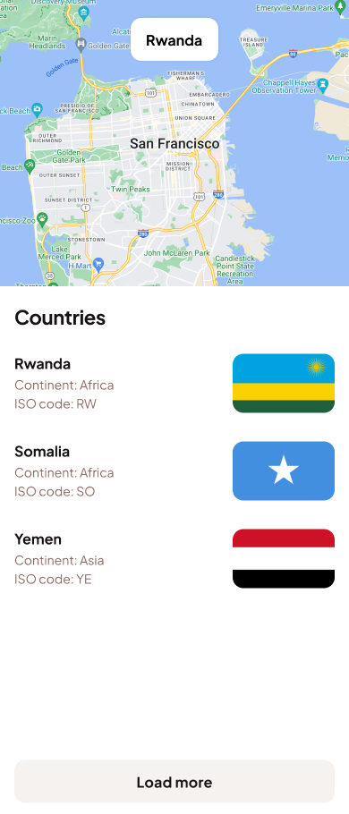
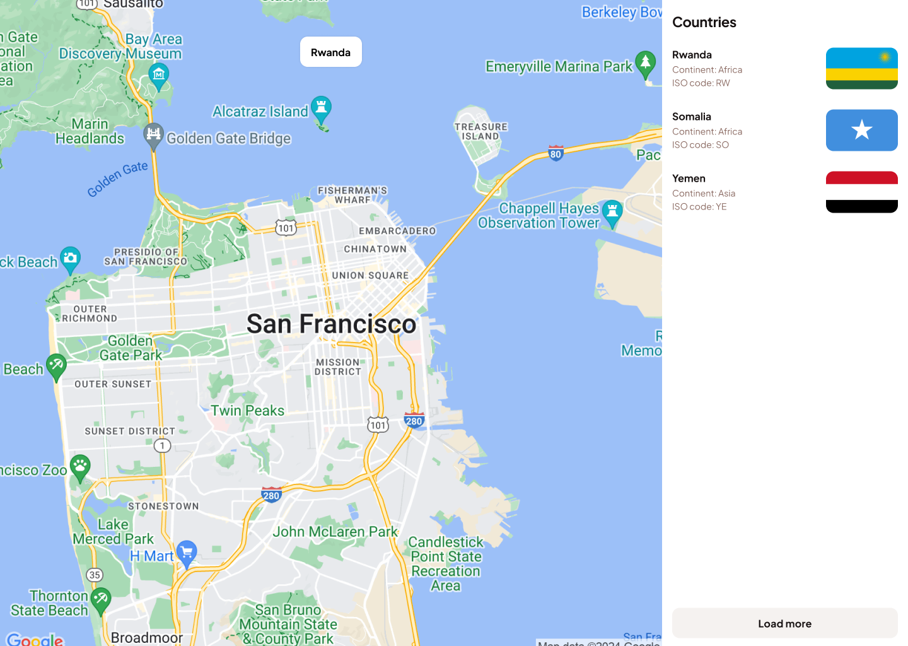

# Xilion test

## Objective:
Develop two separate applications, one using Flutter and the other using React (with Vite), that display a list of countries fetched from a REST API and a local file `locations.json`. This test is designed to assess your skills in mobile and web development, as well as your ability to integrate with RESTful services.
The flutter template can be found in the `mobile` folder and the react template in the `web` folder.

## API Details:
 - Endpoint: https://local.yimi.dev/locations/:page/:limit
 - Method: GET
 - Parameters:
   - `page`: Page number of the results
   - `limit`: Number of countries per page

 - Response example:
```json
{
  "page": 1,
  "total_pages": 26,
  "data": [
    {
      "ID": 0,
      "geoname_id": 49518,
      "locale_code": "en",
      "continent_code": "AF",
      "continent_name": "Africa",
      "country_iso_code": "RW",
      "country_name": "Rwanda",
      "is_in_european_union": 0
    }
  ],
  "is_last_page": false
}
```

## `locations.jsons` Details:
 - The file contains the coordinates of the countries.
 - The file is an array of objects with the following structure:
```json
[
  {
      "cca2": "MD",
      "latlng": [
          47.0,
          29.0
      ]
  },
]
```

## User Interface Design:
The design is available in Figma: [Link to design](https://www.figma.com/file/xA1H8d14d2q2iQHGYM2vUj/Xilion-test?type=design&node-id=1%3A2&mode=design&t=anEB0ytIFqnCwS37-1)

### Preview:



## Requirements:
  - [ ] The list of countries should be displayed in a scrollable list.
  - [ ] Each item in the list should display the country name, continent name, country ISO code and its flag (the flags can be found in the `assets` folder).
  - [ ] The list should be paginated, with a maximum of 10 countries per page.
  - [ ] The list should display a loading indicator while fetching data.
  - [ ] The list should display an error message if the API request fails.
  - [ ] The list should display a button to load more countries if there are more pages to fetch.
  - [ ] The load more button should dissapear if there are no more countries to display.
  - [ ] When the user clicks on a country item, the map should display the location of the country (use the file `locations.json` to get the coordinates of the countries) and display the name of the country at the top.
  - [ ] The map should display a marker at the location of the country.
  - [ ] When the user clicks on the country item, the current country should be persisted in the local storage and displayed when the user closes and reopens the app.

## Evaluation Criteria:
  - [ ] Code quality and organization.
  - [ ] Follow the given user interface design.
  - [ ] Error handling.
  - [ ] Loading indicator.
  - [ ] Use of pagination.
  - [ ] Load more button.
  - [ ] Map display.
  - [ ] Local storage persistence.
  - [ ] Git commit history.

## Submission:
  - [ ] Create a new **private** repository using this template keeping the name **web_mobile_test**.
  - [ ] Commit your code to the repository.
  - [ ] Update the README.md file with your personal information (Full name, contact info, etc.) and the instructions to run the applications.
  - [ ] Include screenshots of the apps running.
  - [ ] Create a release with the tag `v1.0.0` in the repository.
      - [ ] Include an apk file for the Flutter app.
      - [ ] Deploy the React app to a hosting service of your choice like Vercel, Netlify, etc.
  - [ ] Add the users `Noel-S` and `MartinChavez-Ikigo` as collaborators in the repository.